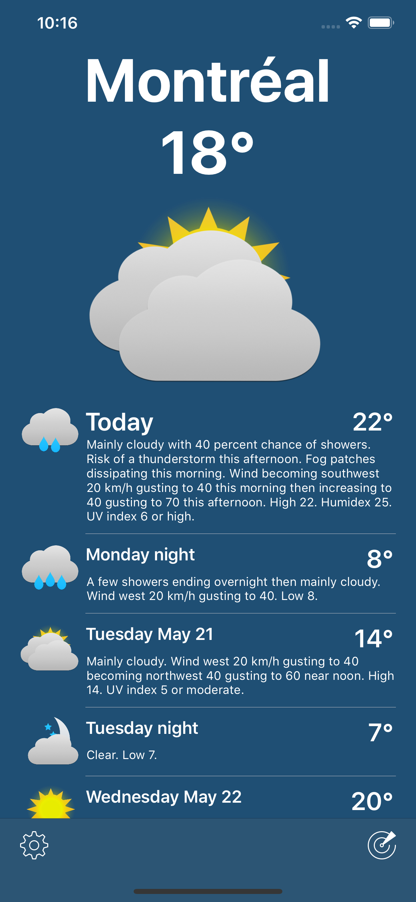

# PréviCA

## Features

- **Environment Canada data** — Weather data sourced from the official Environment Canada API
- **API reference** — Uses the [GeoMet-OGC-API](https://api.weather.gc.ca) for real-time city page weather
- **Current weather** — Displays current conditions including temperature, wind, humidity and more
- **Daily forecast** — Multi-day forecast with detailed day and night predictions
- **Radar view** — Interactive weather radar imagery